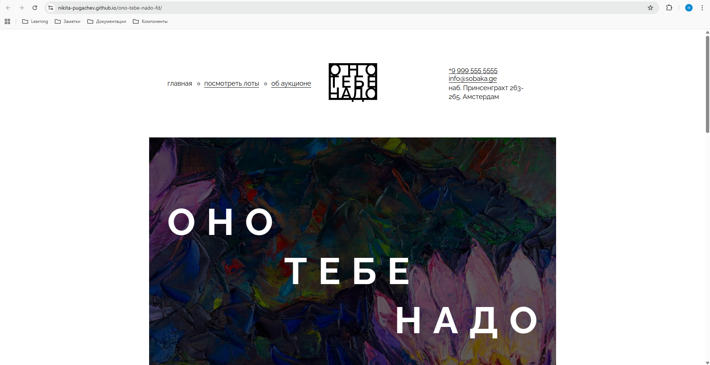
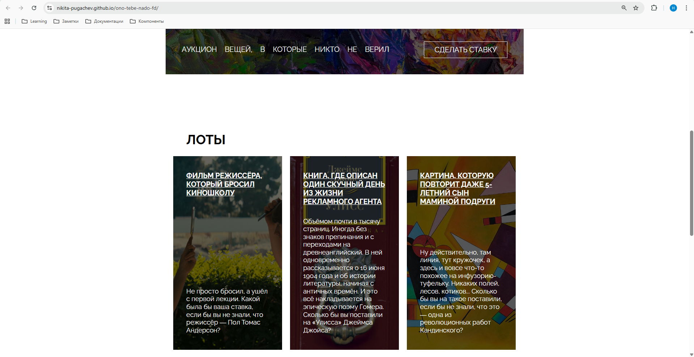
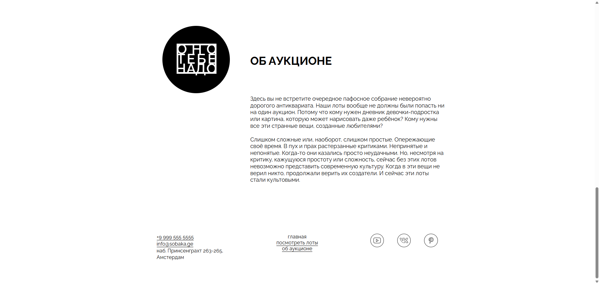

# Проект "Оно тебе надо"

[Просмотреть проект на GitHub](https://github.com/nikita-pugachev/ono-tebe-nado-fd)

[Посмотреть проект на GitHub Pages](https://nikita-pugachev.github.io/ono-tebe-nado-fd/)

## О проекте
Проект "Оно тебе надо" это аукцион вещей, или, если быть точнее, аукцион, на который выставленны исполнившиеся мечты людей. Этот проект - моя самая первая работа в роли начинающего Frontend-разработчика. В нём реализованы базовые навыки вёрстки на HTML и CSS. А так же я планирую написать логику проекту, реализованную на JavaScript.

## Взгляд на проект
<div align="center">



</div>

## Используемые технологии
* HTML
* CSS

## Установка и запуск
**1. Клонирование репозитория**
```bash
git@github.com:nikita-pugachev/ono-tebe-nado-fd.git
```
**2.Запуск**
* Открыть проект в VS Code
* [Установить плагин Live Server](https://marketplace.visualstudio.com/items?itemName=ritwickdey.LiveServer)
* Открыть просмотр проекта в любом браузере с помощью кнопки Go Live